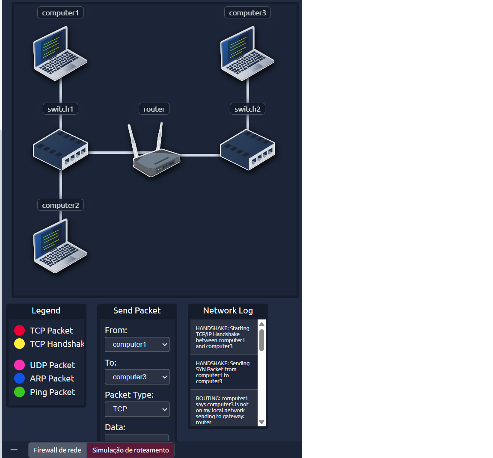

# Log Analysis

This page contains a screenshot and a brief explanation of a basic network log analysis exercise.

## Screenshot

## What was analyzed

- Source and destination IP addresses
- Network ports
- Allowed and blocked traffic

## Why this matters

Log analysis helps identify suspicious behavior and validate firewall rules.
